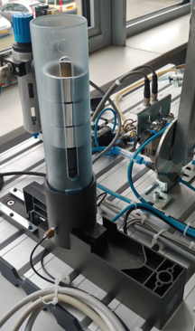
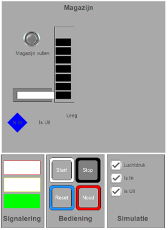
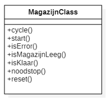
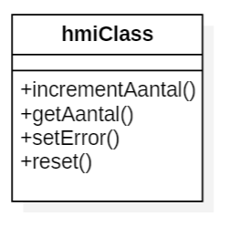

# Thema: Object Oriented Programming
## Context: Bekermagazijn

In deze opdracht ga je het bekermagazijn Object Georiënteerd programeren

**Bekermagzijn Realworld**

**Bekermagzijn Simulatie**

## Besturingseisen
De volgende besturingseisen zijn aan de orde:
* Na opstarten programma gaat groene-lamp branden
* Na drukken op “start” wordt 1 beker uitgestoten
    * Alleen als het magazijn niet leeg is
    * Gedurende het uitstoten is groene-lamp uit
*Als magazijn leeg is zal gele-lamp oplichten
*Als gestart wordt als magazijn leeg is zal rode-lamp oplichten en groene lamp uitgaan. Het systeem gaat in  de “Error”
*De “Error” situatie kan worden opgelost door het geven van een Reset
    * Na de Reset gaat de rode-lamp uit en de groene-lamp aan
* Als er op de “noodstop” wordt gedrukt worden alle actuatoren (direct) gedeactiveerd en gaat het systeem in “Error”

## Opdracht 1 Simulatie
* Maak eerst een testspecificatie
* Maak een object-georiënteerd structured-tekst programma van de beschreven besturingseisen.
* Ga uit van de hieronder getoonde klassendiagram van het magazijn

### De memberfuncties van de MagazijnClass
* *cycle()*: Update de actuatoren(outputs) aan de hand van toestandsveranderingen van de sensoren(inputs)
* *start()*: Start het uitstoten van een beker uit het magazijn. Als het magazijn wordt gestart en het is leeg dan gaat het in de fout-toestand
* *isError()*: Geeft middels een BOOL weer dat er een fout tijdens het uitstoten is opgetreden
* *isMagazijnLeeg()*: Geeft middels een BOOL weer dat het magazijn leeg is
* *isKlaar()*: Geeft middels een BOOL weer er een nieuwe start gegeven kan worden
* *noodstop()*: Voert een noodstop uit, alle actautoren(outputs) worden gedeactiveert, het object gaat in de fout-toestand
* *reset()*: heft een fout-toestand op

### Tips voor de opdracht
* Maak hiervoor gebruik van het voorbereide Codesys project:
    * *“Magazijn Structured Text 2V1 - OO PLC programming.project”*
        * Download: https://github.com/AvansMechatronica/Codesys_IAP.git
        * Zie map: Opdrachten\IAP
* Het hoofdprogramma “MagazijnTest” POU is al geheel voorbereid in hoef je niet meer te wijzigen
    * De klasse “magazijnClass” is in de “MagazijnTest” POU afgeleid als “magazijn” object.
    * Let op: Wijzig in geen geval de code in de map Simulatie
* Maak de klasse “MagazijnClass” compleet
    * Maak eerst de member functies, denk na over
        * Parameters/variabelen
        * Return waardes
    * Maak de code voor alle memberfuncties van de klasse compleet
* Test simulatie de simulatie aan de hand van je testspecificatie

## Opdracht 2 Realworld
* Om het programma te testen in realworld wordt er gebruik gemaakt van één van de PLC opstellingen met een bekermagazijn.
* Configureer de inputs en outputs van de Hitachi PLC
    * Zoek de juiste IO op in de documentatie van de PLC opstelling
* Gebruik het programma (“main” POU) uit deze opdracht (simulatie) om de werking te testen
* Test de functionaliteit van het programma aan de hand van je testspecificatie

## Opdracht 3 HMI
* Maak een HMI waarop de volgende items aanwezig zijn:
    * Aantal uitgestoten: Teller(indicator) welke aan geeft hoeveel bekers zijn uitgestoten
    * Reset aantal: Knop(control) waarmee de teller van het aantal uitgestoten bekers op 0 gezet kan worden.
    * Error: Lamp(indicator) die aangeeft dat het systeem in de fout toestand staat
* Bij de HMI hoort de klasse “hmiClass”

### De memberfuncties van de hmiClass
* *incrementAantal()*: Verhoogt het aantal bekers indicator op het hmi-paneel met 1
* *getAantal()*: Geeft het aantal getelde bekers terug aan aanroepende klasse.
* *setError()*: Afhankelijk van een meegegeven parameter zal de Error-lamp van de hmi oplichten.
* *reset()*: Zet de Error lamp uit en zet de teller van het aantal bekers op 0

### Tips voor de opdracht
* Maak een hmi paneel(visualisatie)
    * Plaats de 3 indicators/controls (aantal, Reset aantal en Error)
    * Koppel de indicators/controls aan een globale variabele
        * Kies functionele namen
* Maak een klasse “hmiClass” 
    * met bijbehorende memberfuncties
* Maak een afgeleid object van de “hmiClass” klasse in het “MagazijnTest” POU
    * Kies een functionele naam voor het object
* Maak de “MagazijnTest” POU compleet, zodanig dat de hmi gaat functioneren
    * Test de functionaliteit
        * Simulatie
        * Real World

