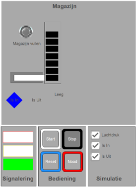
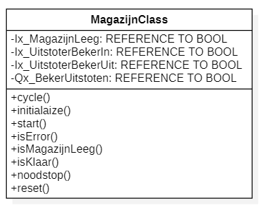

# Thema: Statemachine Programming
## Context: Bekermagazijn

In deze opdracht ga je het bekermagazijn Object Georiënteerd programeren in afzonderlijke toestanden

**Bekermagzijn Realworld**

**Bekermagzijn Simulatie**

## Besturingseisen
De volgende besturingseisen zijn aan de orde:
* Na opstarten programma gaat groene-lamp branden
* Na drukken op “start” wordt 1 beker uitgestoten
    * Alleen als het magazijn niet leeg is
    * Gedurende het uitstoten is groene-lamp uit
*Als magazijn leeg is zal gele-lamp oplichten
*Als gestart wordt als magazijn leeg is zal rode-lamp oplichten en groene lamp uitgaan. Het systeem gaat in  de “Error”
*De “Error” situatie kan worden opgelost door het geven van een Reset
    * Na de Reset gaat de rode-lamp uit en de groene-lamp aan
* Als er op de “noodstop” wordt gedrukt worden alle actuatoren (direct) gedeactiveerd en gaat het systeem in “Error”

## Opdracht 1 Simulatie
* Maak eerst een testspecificatie
* Maak een object-georiënteerd structured-tekst programma van de beschreven besturingseisen.
* Ga uit van de hieronder getoonde klassendiagram van het magazijn

* In het programma is de structuur van een toestanden machine herkenbaar.

### De memberfuncties van de MagazijnClass
Deze kun je terugvinden in de opdracht over het thema *object-georiënteerd programmeren*

### De toestanden van de MagazijnClass
In onderstaande afbeelding is het UML state-dagram weergegeven van de toestanden met toestand-transities waarin de magzijnClasse zich kan bevinden.

### Tips voor de opdracht
* Maak hiervoor gebruik van het voorbereide Codesys project:
    * *“Magazijn Structured Text 2V1 - Statemachine-programming.project”*
        * Download: https://github.com/AvansMechatronica/Codesys_IAP.git
        * Zie map: Opdrachten\IAP
* Het hoofdprogramma “MagazijnTest” POU is al geheel voorbereid in hoef je niet meer te wijzigen
    * De klasse **“magazijnClass”** is in de “MagazijnTest” POU afgeleid als “magazijn” object.
    * Let op: Wijzig in geen geval de code in de map Simulatie
* Maak de klasse **“MagazijnClass”** compleet
    * Maak eerst de member functies, denk na over
        * Parameters/variabelen
        * Return waardes
    * Maak de code voor alle memberfuncties van de klasse compleet
    * Let op: De magazijn toestanden/states zijn al voorbereid in de "**magazijnStates**" enumeratie.  
* Test simulatie de simulatie aan de hand van je testspecificatie

## Opdracht 2 Realworld
* Om het programma te testen in realworld wordt er gebruik gemaakt van één van de PLC opstellingen met een bekermagazijn.
* Configureer de inputs en outputs van de Hitachi PLC
    * Zoek de juiste IO op in de documentatie van de PLC opstelling
* Gebruik het programma (“main” POU) uit deze opdracht (simulatie) om de werking te testen
* Test de functionaliteit van het programma aan de hand van je testspecificatie

## Opdracht 3 HMI
* Integreer de HMI die je hebt gemaakt bij het thema *object-georiënteerd programmeren* in het huidige programma.
* Test bovenstaande integratie

## Opdracht 4 Referenties naar IO
In de MagazijnClass zul je waarschijnlijk koppelingen naar I/O doen via de GVL variabelenlijst.

* *Nadeel*: de klasse is niet toepasbaar in situaties waarin de 
    * GVL variabelenlijst andere benamingen heeft voor IO
    * Er meerder instanties zijn van de class voor meerdere fysieke magazijnen
* *Oplossing*: Het toepassen van referenties naar de IO van de klasse, zie hieronder in de attributenlijst van de klasse

### Tips voor de opdracht
* Pas de magazijnClass aan:
    * Maak de referenties zoals aangegeven in het klassediagram aan in de attributenlijst van de MagazijnClass in codesys
    * Vervang alle verwijzingen in de MagazijnClass naar de GVL variabelenlijst door de verwijzingen naar de gedefinieerde referenties
    * Wijzig in de magazijnClass de *initialaize()* memberfunctie zodanig dat de referenties van de IO geintialiseerd kunnen worden vanuit het hoofdprogramma
* Pas het “MagazijnTest” POU aan
    * Maak een aanroep naar de *initialiaze()* memberfunctie van de magazijnClass (het afgeleide object), waarbij de IO door wordt gegeven doormiddel van referenties

* Test het programma aan de hand van je testspecificatie.

* Zie voorbeelden uit lesstof op brightspace
